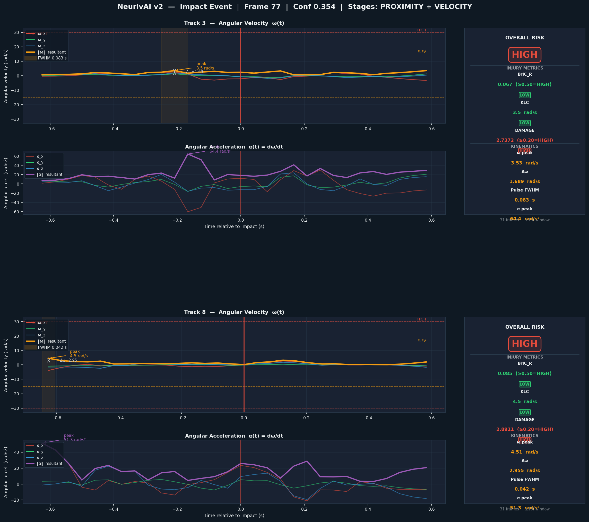

# NeurivAI — Head Impact Detection & Brain Injury Profiling

**Real-time head impact detection in multi-person video with clinically-grounded brain injury metrics.**

NeurivAI processes raw video footage to automatically detect head-to-head collisions, characterise the rotational kinematics of each impact, and compute validated brain injury risk scores — all without any wearable sensors.

---

## Demo

### Cinematic impact freeze — angular velocity sphere overlay

<video src="test_impact_moment.mp4" controls width="100%"></video>

> Phase 1: clean hold on the raw frame · Phase 2: smooth zoom toward the heads · Phase 3: Blinn-Phong shaded spheres fade in, ω arrow encodes resultant angular velocity direction

---

### Full pipeline output — impact detection + annotations

<video src="test_annotated.mp4" controls width="100%"></video>

---

### Kinematic profile — BrIC_R · KLC · DAMAGE per track



---

## Key Features

- **Keypoint-based detection** — uses head keypoints (COCO nose + eyes + ears) instead of bounding boxes, making it scale-invariant and applicable to helmeted and unprotected athletes
- **Three lightweight real-time stages** — proximity, velocity anomaly, and skull rotation all run every frame with negligible compute cost
- **HybrIK deep pass** — full SMPL body pose estimation runs *only* on the short window around each confirmed impact (not on the whole video)
- **Validated brain injury metrics** — BrIC\_R (Takhounts 2013), KLC (Kleiven 2007), and DAMAGE (Gabler 2019) computed from rotation matrices
- **Cinematic visualisation** — Blinn-Phong shaded sphere overlay encodes the 3-D angular velocity vector in the specular highlight position

---

## Architecture

```
╔══════════════════════════════════════════════════════════════════╗
║                    PASS 1  — fast scan                          ║
╚══════════════════════════════════════════════════════════════════╝

Video File
    │
    ▼
┌─────────────────────────────────────────────────────────────────┐
│  Stage 0 — HeadKeypointTracker           head_tracker.py        │
│  Model  : YOLOv8x-pose + ByteTrack                              │
│  Extracts centroid + radius from 5 COCO head keypoints          │
└──────────────────────────┬──────────────────────────────────────┘
                           │
          ┌────────────────┼────────────────┐
          │                │                │
          ▼                ▼                ▼
   Stage 1             Stage 2          Stage 3
   Proximity           Velocity         Skull Rotation
   (head-radius        (z-score         (ear-vector
    normalised)         anomaly)         angular vel.)
   weight: 40%         weight: 35%      weight: 25%
          │                │                │
          └────────────────┴────────────────┘
                           │
                           ▼
              ImpactBuffer — merges signals
              ≥ 2 stages must fire, conf ≥ 0.25

╔══════════════════════════════════════════════════════════════════╗
║                    PASS 2  — deep analysis                      ║
╚══════════════════════════════════════════════════════════════════╝

For each confirmed impact → ±15 frames around event
    │
    ▼
HybrIKRetrospective — SMPL rotation matrices R_head(t) per frame
    │
    ▼
BrainInjuryProfiler
    ω(t)  = log(R(t+1) @ R(t).T) / Δt     [rad/s]
    BrIC_R = max(‖ω‖) / 53.0
    KLC    = max(‖ω‖)                      [rad/s]
    DAMAGE = spring-mass convolution        (ωn=30.1, ζ=0.746)
```

---

## Installation

### 1. Clone and set up environment

```bash
git clone https://github.com/eghbalian-ayda/NeuriveAI.git
cd NeuriveAI
python -m venv venv && source venv/bin/activate
pip install -r requirements.txt
```

### 2. Install HybrIK (required for Pass 2)

HybrIK is not on PyPI — install from source:

```bash
git clone https://github.com/Jeff-sjtu/HybrIK.git ../HybrIK
cd ../HybrIK && pip install -e . && cd ../NeuriveAI
```

### 3. Download model weights

| Weight | Path | Size |
|--------|------|------|
| HybrIK HRNet-W48 | `models/hybrik/hybrik_hrnet.pth` | 309 MB |
| SMPL neutral model | `../HybrIK/.../basicModel_neutral_lbs_10_207_0_v1.0.0.pkl` | — |

> YOLOv8x-pose weights (`yolov8x-pose.pt`) are auto-downloaded on first run.

### 4. Docker (alternative)

```bash
docker compose build
docker compose run --rm pipeline
```

Models must be mounted — they are not baked into the image.

---

## Usage

```bash
python track_video.py --video path/to/video.mp4
```

| Argument | Default | Description |
|----------|---------|-------------|
| `--video` | required | Input video path |
| `--window` | `15` | Half-window for HybrIK (frames either side of impact) |
| `--show` | off | Display live OpenCV preview during Pass 1 |

**Outputs:**

| File | Description |
|------|-------------|
| `{name}_annotated.mp4` | Annotated video with impact highlights + brain injury badges |
| `{name}.impact_report.json` | All events with brain injury profiles |

**Cinematic visualisation (optional post-processing):**

```bash
python impact_moment_viz.py \
    --annotated test_annotated.mp4 \
    --source    test.mp4 \
    --report    test.impact_report.json \
    --out       test_impact_moment.mp4
```

---

## Pipeline Stages

| Stage | File | Signal | Weight |
|-------|------|--------|--------|
| 0 — HeadKeypointTracker | `head_tracker.py` | YOLOv8x-pose + ByteTrack | — |
| 1 — ProximityDetector | `proximity_detector.py` | Normalised head distance | 40% |
| 2 — KeypointVelocityDetector | `velocity_detector.py` | Centroid displacement z-score | 35% |
| 3 — SkullRotationDetector | `skull_rotation_detector.py` | Ear-vector angular velocity | 25% |
| 4 — HybrIKRetrospective | `hybrik_retrospective.py` | SMPL head rotation matrices | deep pass only |

---

## Brain Injury Metrics

| Metric | Formula | Reference | Risk thresholds |
|--------|---------|-----------|-----------------|
| **BrIC\_R** | `max(‖ω‖) / 53.0` | Takhounts 2013 | LOW < 0.25 ≤ ELEVATED < 0.50 ≤ HIGH |
| **KLC** | `max(‖ω‖)` rad/s | Kleiven 2007 | LOW < 15 ≤ ELEVATED < 30 ≤ HIGH |
| **DAMAGE** | spring-mass convolution of ω | Gabler 2019 | LOW < 0.10 ≤ ELEVATED < 0.20 ≤ HIGH |

Angular velocity `ω(t)` is computed from SMPL rotation matrices via the matrix logarithm map, then smoothed with a Savitzky-Golay filter (window=7, poly=2).

---

## File Structure

```
NeuriveAI/
├── track_video.py              ← pipeline entry point
├── head_tracker.py             ← Stage 0: YOLOv8x-pose + ByteTrack
├── proximity_detector.py       ← Stage 1: normalised head distance
├── velocity_detector.py        ← Stage 2: centroid z-score anomaly
├── skull_rotation_detector.py  ← Stage 3: ear-vector angular velocity
├── impact_buffer.py            ← signal merger + event queue
├── hybrik_retrospective.py     ← Stage 4: on-demand HybrIK
├── brain_injury_profiler.py    ← BrIC_R / KLC / DAMAGE
├── impact_moment_viz.py        ← cinematic freeze visualisation
├── plot_profiles.py            ← kinematic profile plots
├── requirements.txt
├── Dockerfile / docker-compose.yml
└── models/
    └── hybrik/
        └── hybrik_hrnet.pth    ← HybrIK weights (309 MB, not in repo)
```

---

## References

| Metric | Paper |
|--------|-------|
| BrIC | Takhounts et al., *Stapp Car Crash Journal* 57, 2013 |
| KLC | Kleiven, *Stapp Car Crash Journal* 51, 2007 |
| DAMAGE | Gabler et al., *J. Neurotrauma* 36(4), 2019 |
| HybrIK | Li et al., *CVPR* 2021 |
